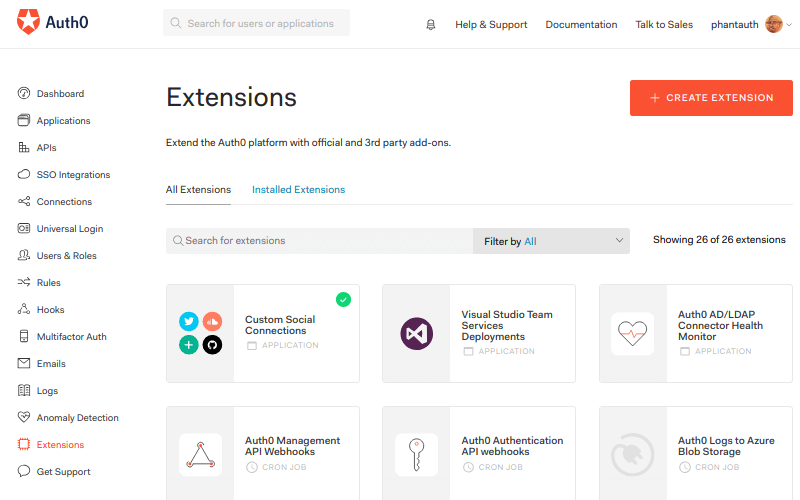
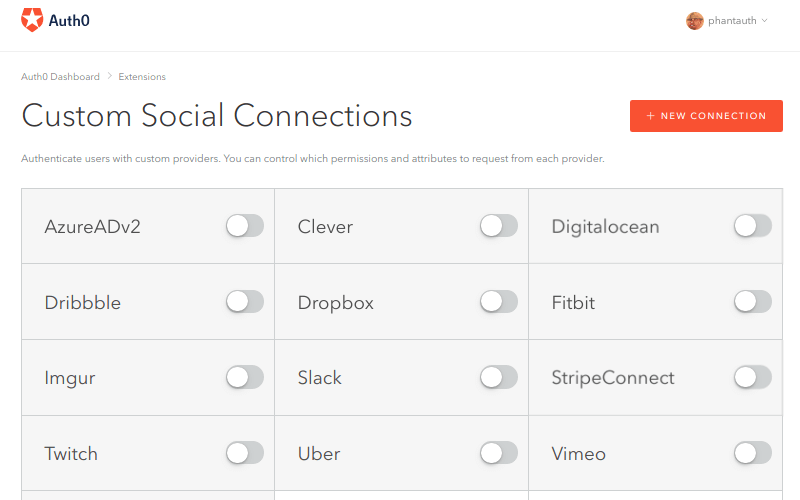
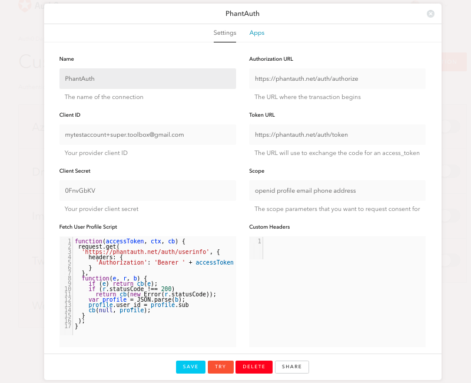
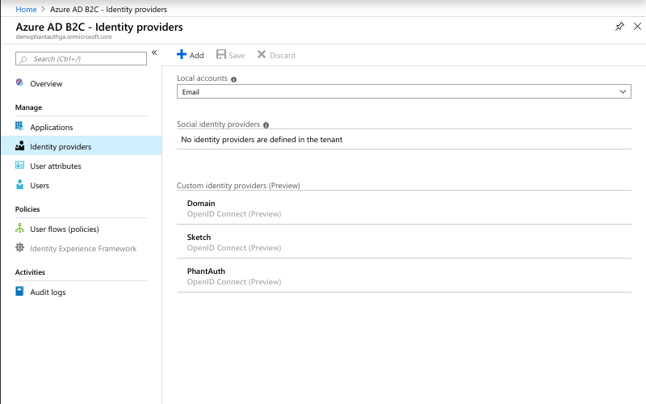
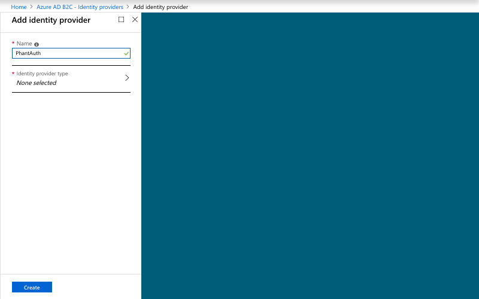
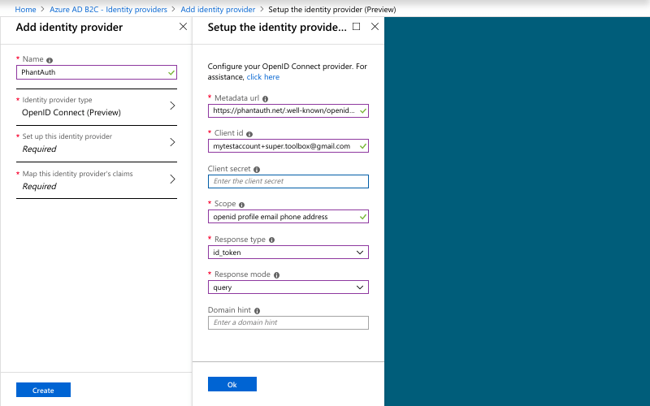
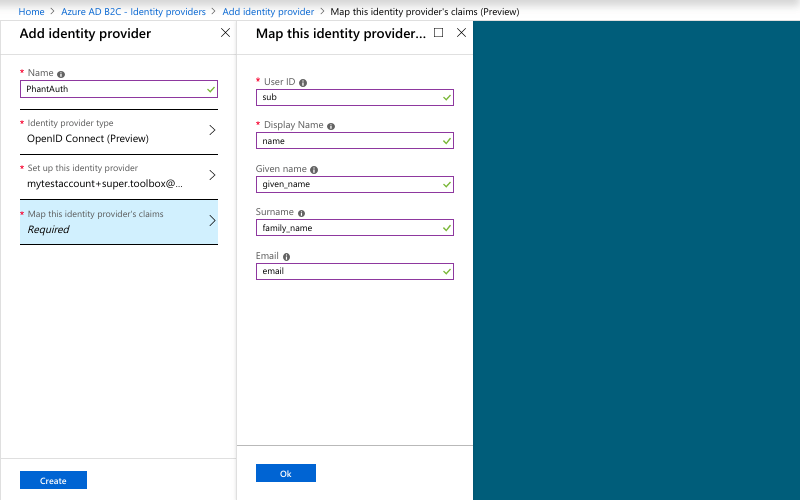

# Integration

A PhantAuth elsősorban egy OpenID Connect Provider, mely támogatja az OpenID Connect specifikációban szereplő workflow-kat (Hybrid, Implicit, Authorization Code) valamint az OAuth 2.0 specifikációban szerepő Resource Owner grant type-ot. Az integrálás mikéntje az adott authentikációs library, vagy identity integrátor szolgáltatás lehetőségeinek megfelelően történik. Jelen dokumentum tartalmazza az integráláshoz szükséges információkat, módszereket, valamint néhány konkrét környezetbe történő integrálás lépéseit. 

# Parameters

Az integráláshoz jellemzően az alábbi paraméterek szükségesek:

 - [Issuer](#issuer)
 - [Discovery Endpoint](#discovery-endpoint)
 - [Authorization Endpoint](#authorization-endpoint)
 - [Token Endpoint](#token-endpoint)
 - [Client Credentials](#client-redentials)
 - [Scope](#scope)

## Issuer

Az Issuer URL azonosítja az OpenID Connect Providert, PhantAuth default [tenant](tenant) esetén az értéke:

```
https://phantauth.net
```

PhantAuth esetén az Issuer URL egy dokumentációs web lap is egyben, mely tartalmazza az adott [tenant](tenant) használatához szükséges információkat.

## Discovery Endpoint

Amennyiben az adott authentikációs library támogatja az OpenID Connect Discovery 1.0 specifikáció Obtain OpenID Provider Configuration Information fejezetében definiált konfigurációs protokollt, úgy nem szükséges a különböző végpontok egyedi konfiurálása. Bár a specifikáció rögzíti az Issuer URL-hez relatívan a Discovery Endpoint címét, néhány authentikációs library elvárja ennek manuális beállítását. PhantAuth default [tenant](tenant) esetén a Discovery Endpoint címe:

```
https://phantauth.net/.well-known/openid-configuration
```

## Authorization Endpoint

Mindhárom OpenID Connect Flow esetén szükséges az Authorization Endpoint címének megadása amennyiben az adott authentikációs library nem implementálja az OpenID Connect Discovery specifikációt. PhantAuth default [tenant](tenant) esetén az Authorization Endpoint címe:

```
https://phantauth.ml/auth/authorize
```

## Token Endpoint

Authorization Code Flow és Hybrid Flow esetén szükséges a Token Endpoint címének megadása amennyiben az adott authentikációs library nem implementálja az OpenID Connect Discovery specifikációt. PhantAuth default [tenant](tenant) esetén az Token Endpoint címe:

```
https://phantauth.ml/auth/token
```

## Client Credentials

Az OAuth 2.0 és OpenID Connect provider-ekhez (mint a PhantAuth) történő integrálódáshoz a kliens programnak szüksége van két alapvető credential értékre, a `client_id`-re és a `client_secret`-re.

A legtöbb OpenID Connect Provider-től eltérően PhantAuth használata esetén nem szükséges a kliens programot előre regisztrálni. A kliens minen adata a `client_id`-ből generálódik, mely generálható véletlenszerűen vagy megadható testreszabott módon.

### Random client_id

Automata tesztekhez vagy a PhantAuth kipróbálásához tökéletesen megfelelnek a véletlenszerűen generált kliensek. Ez esetben nem szempont hogy a felhasználó milyen kliens nevet vagy logo-t lát pl a consent lapont. Véletlenszerűen generált kliens készítéséhez egyszerűen el le kell kérni a PhantAuth generátorának client végpontját paraméterek nélkül s minden alkalommal új véletlenszerűen generált klienst kapunk.

```bash
curl https://phantauth.net/client
```

A válaszban a generált kliens jellemzői között megtalálható a `client_id` és `client_secret` értéke.

```json
{
  "client_id": "domainer~bneq2uxl4ne",
  "client_secret": "HkXeFv39",
  "client_name": "Domainer",
  "software_id": "k-evxHCu77yOuXjiC21hug",
  "software_version": "8.9.9",
  "client_uri": "https://phantauth.net/client/domainer%7Ebneq2uxl4ne/profile",
  "logo_uri": "https://www.gravatar.com/avatar/ed23979b656f48420bec4552ce903baa?s=256&d=https%3A%2F%2Favatars.phantauth.net%2Ficon%2FqaQWD7dn.png",
  "logo_email": "domainer.VB3SUYQ@mailinator.com",
  "policy_uri": "https://phantauth.net/client/domainer%7Ebneq2uxl4ne/policy",
  "tos_uri": "https://phantauth.net/client/domainer%7Ebneq2uxl4ne/tos",
  "@id": "https://phantauth.net/client/domainer%7Ebneq2uxl4ne"
}
```

Ez esetben a kliens logo-ja a válaszban szereplő `logo_email` email címhez tartozó gravatar kép lesz, mely a gravatar.com használatával akár testre is szabható.

### Customized client_id

Különböző bemutatók, demo-k esetén célszerű testreszabott klienst használni, hogy a kliens név és logo megegyezzen a tesztelés, bemutatás alatt álló kliens nevével, logo-jával. Ennek legegyszerűbb módja, ha készítünk egy tag-elt email címet valamely ezt támogató email szolgáltatónál. Rendszerint a tag elválasztására a `+` karakter használatos.

Első lépésként hozzunk létre egy, a tesztelésre használt email account-ot (használhatjuk a saját email címünket is, de nem praktikus, mert mivel szerepelni fog a client_id-ben, valószínűleg több helyen megjelenik majd különböző log-okban).

```
mytestaccount@PROVIDER
```

A `PROVIDER` tetszőleges, tag-elt email címek használatát támogató szolgáltató, pl gmail.com, zoho.com, outlook.com, protonmail.com stb.

Ezt követően képezzünk a kliens nevével (pl "Super Toolbox") egy tag-el email címet, az esetleges space karaktereket pont karakterre cserélve (az erre a címre érkező levelek az eredeti `mytestaccount` mailbox-ba érkeznek majd).

```
mytestaccount+Super.Toolbox@PROVIDER
```

Használjuk az így kapott email címet `client_id` értékként. A PhantAuth client végpontot ezzel a `client_id`-vel paraméterezve lekérhetők a kliens adatai, köztük a `client_id`:

```bash
curl https://phantauth.net/client/mytestaccount%2bSuper.Toolbox@gmail.com
```

A válaszban megtaláljuk a `client_id`-hez tartozó generált `client_secret` értéket.

```json
{
  "logo_email": "mytestaccount+super.toolbox@gmail.com",
  "client_id": "mytestaccount+super.toolbox@gmail.com",
  "client_secret": "0FnvGbKV",
  "client_name": "Super Toolbox",
  "tos_uri": "https://phantauth.ga/client/mytestaccount%2Bsuper.toolbox%40gmail.com/tos",
  "software_id": "iAVFmT30EG2fzz_kpS-fhA",
  "software_version": "3.0.3",
  "client_uri": "https://phantauth.ga/client/mytestaccount%2Bsuper.toolbox%40gmail.com/profile",
  "logo_uri": "https://www.gravatar.com/avatar/a4d8b22302e6111b5630b3e32827060b?s=256&d=https%3A%2F%2Favatars.phantauth.net%2Ficon%2FDdwpAXe1.png",
  "policy_uri": "https://phantauth.ga/client/mytestaccount%2Bsuper.toolbox%40gmail.com/policy",
  "@id": "https://phantauth.ga/client/mytestaccount%2Bsuper.toolbox%40gmail.com"
}
```

Mint látható ez esetben a `logo_email` értéke a paraméterként megadott email cím, azaz a logo testreszabása az általunk létrehozott email cím gravatar.com avatar-jának testreszabásával megtehető. A `client_name` az általunk megadott név lesz, a pont karakterek szóközre cserélődnek, a szavak kezdőbetűi pedig nagybetűre.

## Scope

A PhantAuth támogatja az OpenID Connect specifikációban szereplő scope értékeket, így azok bármelyike használható. A felhasználó standard adatainak lekérdezéséhez az alábbi scope lista megadása szükséges:

```
openid profile email phone address
```

Bizonyos esetben a PhantAuth által visszaadott `sub` claim értéke túl hosszú az adott környezet (pl Auth0) számára. Ilyenkor használható a `uid` scope, mely az adott felhasználó rövidített felhasználói azonosítóját tartalmazó `uid` claim lekérését jelenti. Azaz a teljes támogatott scope lista:

```
openid profile email phone address uid
```

Az `uid` scope és claim nem szabványos, PhantAuth specifikus!

## User Info Endpoint

Rendszerint az authentikációs library-k nem igénylik a User Info Endpoint beállítását (egy két kivételtől eltekintve), azonban hasznos lehet az adott felhasználó adatainak lekérdezéséhez. PhantAuth default [tenant](tenant) esetén az User Info Endpoint címe:

```
https://phantauth.ml/auth/userinfo
```

## Client Registration Endpoint

A PhantAuth implementálja az OAuth 2.0 Dynamic Client Registration Protocol-t. Amennyiben az adott library támogatja a dinamikus regisztrációt, úgy nem szükséges a [Client Credentials](#client-credentials) pontban leírtaknak megfelelő credentials értékek beállítása. PhantAuth default [tenant](tenant) esetén a Client Registration Endpoint címe:

```
https://phantauth.ml/auth/register
```

## JWKS Endpoint

Rendszerint az authentikációs library-k nem igénylik a JWKS Endpoint beállítását. PhantAuth default [tenant](tenant) esetén értéke:

```
https://phantauth.ml/auth/jwks
```

# Direct integration

HTML/Javacript alkalmazások számára egyszerű OpenID Connect integrációs lehetőséget ad az [oidc-client](https://github.com/IdentityModel/oidc-client-js) library. E library használata során elegendő az `issuer` és a `client_id` megadása.

```javascript
  Oidc.OidcClient(
    {
      authority: 'https://phantauth.net',
      client_id: 'mytestaccount+super.toolbox@gmail.com',
      redirect_uri: window.location.href,
      response_type: 'id_token token',
      scope: 'openid profile email phone address uid',
      filterProtocolClaims: false,
      loadUserInfo: false
    }
  );
```

Az [OpenID Connect Test Page](https://www.phantauth.net/test/oidc) oldalon kipróbálható az integráció. Az oldal forrása példaként is szolgál az integráció mikéntjére.

# Auth0

Az [Auth0](https://auth0.com) az egyik legnépszerűbb authentikációs integrátor szolgáltatás. Segítségével a legkülönbözőbb identity provider-ek köthetők be egységes módon az alkalmazásba. A bekötött provider-ek köre az alkalmazás módosítása nélkül bővíthető, módosítható. Mivel a PhantAuth csak teszteléshez használatos, célszerű egy, az Auth0-hoz hasonló integrátoron keresztül bekötni az alkalmazásba, mert így bármikor ki-be- kapcsolható, illetve az alkalmazás különböző environment-jeihez (test, demo, stb) az alkalmazás módosítása nélkül hozzáadható.

Az Auth0-n keresztüli integráció az Auth0 **Custom Social Connections** nevű extension-jén keresztül történik, mely az **Extensions** menüponton keresztül érhető el.

> 

> 

Itt a **NEW CONNECTION** gomb segítségével lehet új OpenID Connect kapcsolatot definiálni.

> 

Itt a szokásos [paraméterek](#parameters) mellett meg kell adni egy JavaScript metódust, mely az `access token` birtokában lekérdezi a bejelentkezett felhasználó adatait. Ez legegyszerűbben a `userinfo endpoint` lekérdezésével tehető meg. Az alábbi kódrészlet elvégzi a lekérdezést s az egyetlen szükséges property mapping-et (Az OpenID Connect standard sub property-jét az Auth0 user_id property-jére):

```javascript
function(accessToken, ctx, cb) {
  request.get(
    'https://phantauth.net/auth/userinfo', {
      headers: {
        'Authorization': 'Bearer ' + accessToken
      }
    },
    function(e, r, b) {
      if (e) return cb(e);
      if (r.statusCode !== 200)
        return cb(new Error(r.statusCode));
      var profile = JSON.parse(b);
      profile.user_id = profile.sub
      cb(null, profile);
    }
  );
}
```

A PhantAuth [Auth0 Test Page](https://www.phantauth.net/test/auth0) oldalon kipróbálható az Auth0 integráció.
Az oldal az *Auth0 JavaScript SDK* felhasználásával készült.

# Azure AD B2C

Az Azure Active Directory B2C a Microsoft authentikációs integrációs megoldása végfelhasználói alkalmazások számára. Az OpenID Connect támogatás még csak preview státuszban van s viszonylag minimális számú property használatát teszi lehetővé. Mint identity provider integrátor, használata az Auth0-hoz hasonló előnyökkel jár, azaz az alkalmazás módosítása nélkül egyszerűen beköthető a PhantAuth a teszt környezetekbe (test, demo stb) mint identity provider.

Az Azure porálon az Azure AD B2C **Identity Providers* menüpontjában találhatók a bekonfigurált identity provider-ek.

> 

Ide az **Add** gomb segítségével vehető fel új provider.

> 

Identity Provider type-ként **OpenID Connect**-et kell kiválasztani, majd ezt követően a **Setup this identity provider** menüpontban adhatók meg a PhantAuth paraméterek. Mivel az *OpenID Connect Discovery* támogatott a végpontok címét nem kell egyedileg beállítani, elegendő a metadata URL-t megadni. Fontos megjegyezni, hogy itt nem az `issuer` URL-t kell megadni, hanem az *OpenID Connect Discovery* specifikációban rögzített teljes metadata URL-t, azaz az issuer-t kötelezően követi a '/.well-known/openid-configuration' suffix. PhantAuth esetén a következő URL-t kell megadni:

```
https://phantauth.net/.well-known/openid-configuration
```

A szokásos paramétereken kívül meg kell adni a *Response type* értékét, mely `id_token` kell legyen, valamint a *Response mode* értékét, mely `query` kell legyen.

> 

A paramétereken kívül meg kell egy mappinget, mely az OpenID Connect claim-ek Azure AD B2C propery-k közötti összerendelést adja meg. Az összerendeléshez az alábbi táblázatban szereplő értékeket szükséges beállítani:

Field label | Value
------------|------
User ID     | sub
Display Name| name
Given name  | given_name
Surname     | family_name
Email       | email


> 

A PhantAuth [Azure AD B2C Test Page](https://www.phantauth.net/test/azure) oldalon kipróbálható az Azure AD B2C integráció.
Az oldal a *Microsoft Authentication Library for JavaScript (MSAL.js)* felhasználásával készült.

# Other Integrations

A fenti példák csak szemléltető jellegűek, a PhantAuth mint standard OpenID Connect provider tetszőleges az OpenID Connect szabványt támogató környezetbe integrálható.
